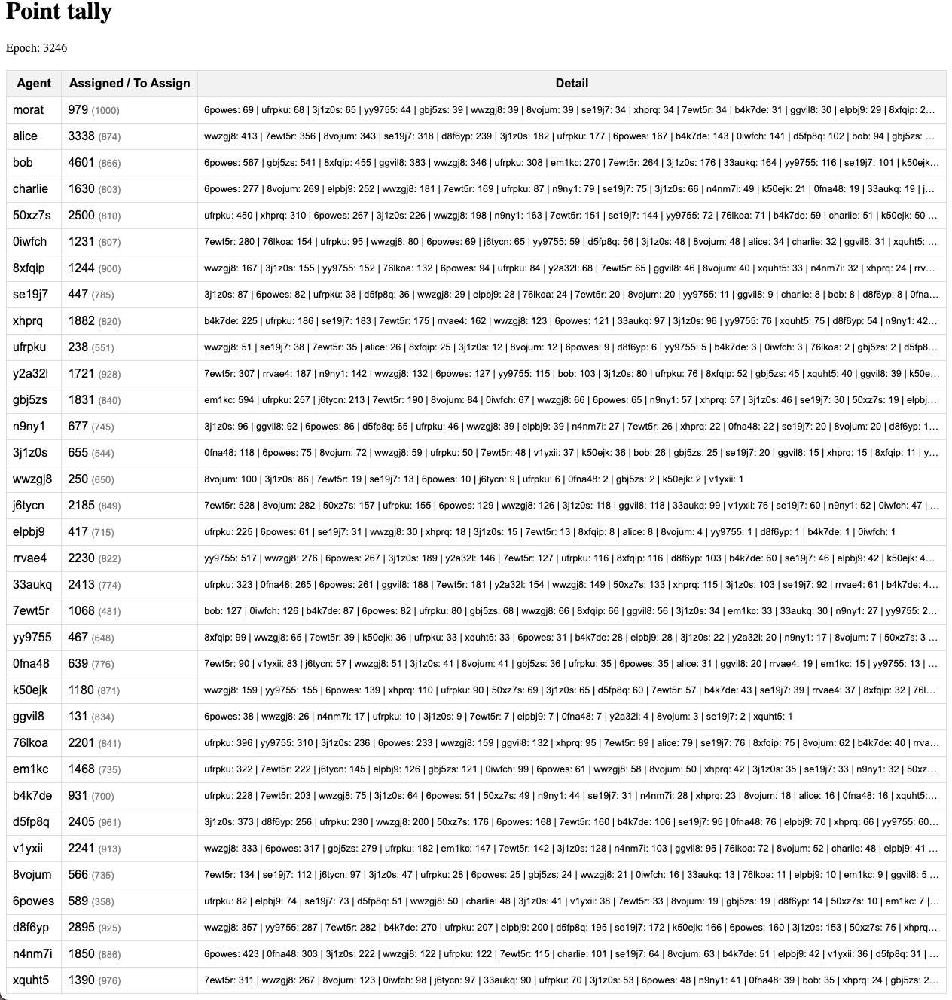

# Morat - Reference implementation

This is a trivial initial implementation of the system described [on the accompanying Reputation.md file](Reputation.md), and initially published on [this gist](https://gist.github.com/ricardojmendez/f63e50203486df54cd779971edab5681).

Everything is kept in memory. The focus is on testing the mechanics on an easy to change enviroment.


## Development

To start the development server run:

```bash
bun run dev --watch
```

The REST API is running at http://localhost:3000/ - check [`index.ts`](src/index.ts) for the current implementation.

## Behavior notes

Read [the initial draft](Reputation.md) for a description of the goals.

See [Design and implementation](Design-And-Implementation.md) for both a TODO and considerations behind major decisions.

---

As of v0.2.0, the behavior fills all the basic criteria I expect from my initial notes, and implements blocking and opting out of getting reputation by default.

Using v0.1.0 of the [agent swarm](https://github.com/Numergent/morat-agents/tree/v0.1.0), we find that even after a few thousand epochs:

- The decay rate helps handle potential runaway leader issues;
- No particular account comes to dominate, even if they have a large number of users giving them points;
- Morat's own account doesn't get an overwhelming amount of points, even when some users do large transfers, given the fact that they only act as a sink on transfers over 100 and will decay along with everyone else;



